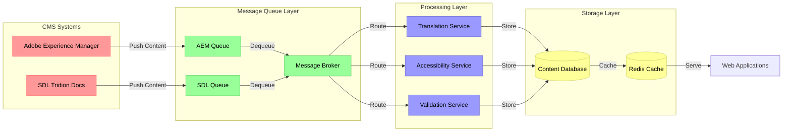

Let me provide a comprehensive review of the RRD Content Hub architecture and suggest improvements:

###  Database Design Review and Enhancement


The current database design uses a simple many-to-many relationship between content and metadata. While functional, it lacks several important aspects for enterprise-scale content management:

1. Content Versioning
          - Missing historical tracking of content changes
  - No audit trail for modifications
  - Version control for concurrent updates


2. Metadata Structure
          - Limited metadata fields
  - No hierarchical relationships
  - Missing content categorization


Here's an enhanced database schema incorporating these improvements:

```sql
CREATE TABLE CONTENT_VERSIONS (
    id INT PRIMARY KEY IDENTITY(1,1),
    content_id INT,
    version_number INT,
    content_text TEXT,
    status VARCHAR(50),
    created_at DATETIME,
    updated_by VARCHAR(100),
    FOREIGN KEY (content_id) REFERENCES CONTENT(id)
);

CREATE TABLE METADATA_CATEGORIES (
    id INT PRIMARY KEY IDENTITY(1,1),
    category_name VARCHAR(100),
    description TEXT,
    parent_category_id INT NULL,
    FOREIGN KEY (parent_category_id) REFERENCES METADATA_CATEGORIES(id)
);

CREATE TABLE CONTENT_METADATA_VALUES (
    id INT PRIMARY KEY IDENTITY(1,1),
    content_version_id INT,
    metadata_category_id INT,
    value_text TEXT,
    value_numeric DECIMAL(18,4) NULL,
    value_datetime DATETIME NULL,
    FOREIGN KEY (content_version_id) REFERENCES CONTENT_VERSIONS(id),
    FOREIGN KEY (metadata_category_id) REFERENCES METADATA_CATEGORIES(id)
);
```

###  CMS Integration Architecture


The proposed integration with Adobe Experience Manager and SDL Tridion Docs needs enhancement for scalability and reliability:

1. Current Limitations:
          - Direct API calls without queuing mechanism
  - No retry logic for failed operations
  - Lack of transaction management


Enhanced Integration Flow:



The diagram illustrates the enhanced architecture with several key components:
- Red boxes represent CMS systems that initiate content updates
- Green boxes show the message queue layer that handles asynchronous processing
- Blue boxes indicate various processing services for content transformation
- Yellow boxes represent storage layers, including both persistent storage and caching


Each piece of content flows through multiple stages:
1. CMS pushes content to dedicated queues
2. Message broker routes content to appropriate processing services
3. Multiple services can process content simultaneously
4. Processed content is stored in the database and cached for fast retrieval

###  Implementation Details


The Node.js API implementation needs robust error handling and monitoring:

```javascript
const express = require('express');
const { v4: uuidv4 } = require('uuid');
const winston = require('winston');

// Logger configuration
const logger = winston.createLogger({
    level: 'info',
    format: winston.format.json(),
    transports: [
        new winston.transports.File({ filename: 'error.log', level: 'error' }),
        new winston.transports.File({ filename: 'combined.log' })
    ]
});

const app = express();

async function processContent(content, metadata) {
    const correlationId = uuidv4();
    
    try {
        // Transaction wrapper
        await db.transaction(async (trx) => {
            const contentId = await trx('CONTENT')
                .insert({
                    title: content.title,
                    content: content.text,
                    created_at: new Date()
                })
                .returning('id');
            
            await Promise.all(
                metadata.map(m => trx('METADATA')
                    .insert({
                        type: m.type,
                        description: JSON.stringify(m.value),
                        content_id: contentId[0]
                    }))
            );
        });
        
        return { success: true, correlationId };
    } catch (error) {
        logger.error(`[${correlationId}] Error processing content: ${error.message}`);
        throw new Error('Failed to process content');
    }
}

app.post('/api/content', async (req, res) => {
    try {
        const result = await processContent(req.body.content, req.body.metadata);
        res.status(201).json(result);
    } catch (error) {
        res.status(500).json({ 
            error: error.message,
            correlationId: error.correlationId || uuidv4() 
        });
    }
});
```

###  Security and Compliance Enhancements


The security implementation should include:

1. Authentication
          - OAuth 2.0 for external integrations
  - JWT-based session management
  - Role-based access control


2. Data Protection
          - Field-level encryption for sensitive data
  - Audit logging with correlation IDs
  - Regular security assessments


Compliance requirements:
```typescript
interface AuditRecord {
    correlationId: string;
    operation: 'CREATE' | 'UPDATE' | 'DELETE';
    resourceType: string;
    resourceId: string;
    userId: string;
    timestamp: Date;
    metadata?: Record<string, unknown>;
}

class ComplianceService {
    private readonly auditRepository: IAuditRepository;
    
    async recordOperation(record: AuditRecord): Promise<void> {
        await this.auditRepository.create(record);
        // Send notification to compliance team for sensitive operations
        if (record.operation === 'DELETE') {
            await this.notifyComplianceTeam(record);
        }
    }

    private async notifyComplianceTeam(record: AuditRecord): Promise<void> {
        // Implementation for compliance notifications
    }
}
```

###  Cross-Functional Collaboration


Key recommendations for successful implementation:

1. Documentation Standards
          - API documentation using OpenAPI specification
  - Database schema documentation
  - Integration patterns documentation


2. Development Workflow
          - Code reviews with security checklist
  - Automated testing requirements
  - Deployment validation procedures


3. Monitoring and Maintenance
          - Performance metrics dashboard
  - Error tracking and alerting
  - Regular security audits


This enhanced architecture provides a more robust foundation for the RRD Content Hub while maintaining scalability and reliability. The addition of proper error handling, monitoring, and security measures ensures enterprise-grade quality suitable for large-scale content management operations.
